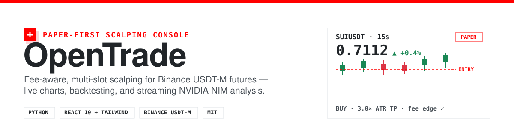
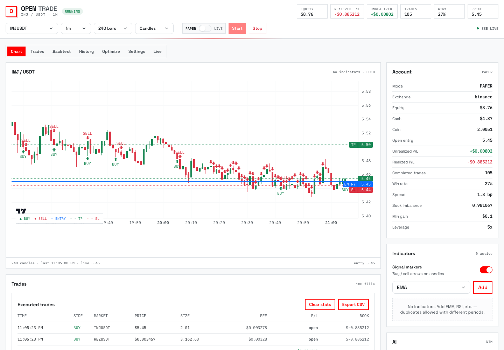
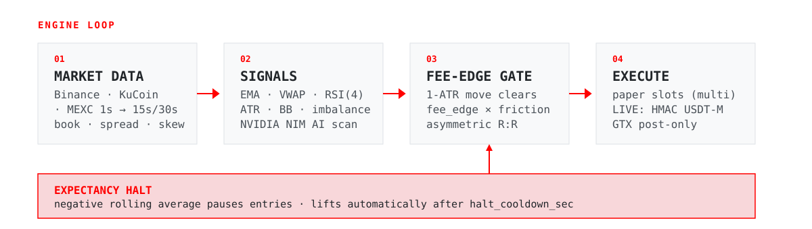

# OpenTrade

> A paper-first, fee-aware scalping console for Binance USDT-M futures. Live charts, multi-slot execution, backtesting, and streaming NVIDIA NIM analysis in one self-contained app.

<p align="center">
  
</p>

<p align="center">
  
</p>

## What it is

OpenTrade is a zero-dependency Python console paired with a React dashboard for sub-minute scalping. It runs **paper by default** and only sends real orders when you explicitly arm LIVE mode with Binance USDT-M API keys. Every entry passes through a hard fee gate, so the strategy optimizes for surviving fees before it optimizes for anything else.

- **Paper-first** — simulated fills on real market data; no keys needed to chart, signal, or backtest.
- **Multi-exchange data** — Binance, KuCoin, and MEXC public candles and order books.
- **Multi-slot cadence** — up to 12 concurrent positions across a rotating whitelist.
- **Sub-minute bars** — synthetic 15s/30s candles aggregated from 1s klines.
- **Streaming AI analysis** — NVIDIA NIM re-ranks scan candidates and confirms entries (optional).
- **Built-in backtester + optimizer** — with holdout validation.

## Why it's different

Most scalpers die on fees. OpenTrade treats the all-in cost of a round trip as a hard constraint, not an afterthought:

- The expected **1-ATR move must clear `fee_edge_mult` × friction** (fees + slippage + spread) before an entry fires.
- The gate reads ATR directly, so raising `atr_tp_mult` reaches for a bigger target **without** quietly loosening the entry filter.
- Reward:risk stays asymmetric — `atr_tp_mult` (default 3.0) sets the target, `atr_sl_mult` (default 0.5) sizes the stop, and `stop_loss_pct` is a ceiling, not a fixed stop.
- Leverage amplifies the fee drag on equity; it does **not** reduce the required price move.

## How it works

<p align="center">
  
</p>

1. **Market data** — public candles and order book, aggregated into 15s/30s synthetic bars.
2. **Signals** — EMA 8/21 trend, VWAP location, RSI(4) timing, ATR/BB volatility, book imbalance, and optional chart-AI confirm.
3. **Fee-edge gate** — the hard 1-ATR-vs-friction filter plus asymmetric reward:risk.
4. **Execution** — concurrent paper slots, or LIVE HMAC orders on Binance USDT-M.
5. **Expectancy halt** — a negative rolling average pauses entries and auto-lifts after `halt_cooldown_sec`.

## Quick start

Requires Python 3 (the backend is standard-library only) and Node 18+.

```sh
# 1. build the UI (writes web/dist)
cd frontend
npm install
npm run build
cd ..

# 2. start the console
python3 app.py
```

Open http://127.0.0.1:8765 — it boots in paper mode with public market data.

Live reload during development (requires [Bun](https://bun.sh)):

```sh
cd frontend && bun run dev   # starts API + Vite together
```

## Configuration

Everything is adjustable from the Settings panel in the UI, or via `.env`. Copy `.env.example` to `.env` and fill in only what you need — never commit `.env`.

| Variable | What it enables |
| --- | --- |
| `NVIDIA_API_KEY` | Streaming NVIDIA NIM chart analysis (`ai_scan`) |
| `NVIDIA_NIM_MODEL` | NIM model override (default `meta/llama-3.2-11b-vision-instruct`) |
| `BINANCE_API_KEY` | Live USDT-M futures trading |
| `BINANCE_API_SECRET` | Live USDT-M futures trading |
| `PORT` | Overrides the default port `8765` |

Two presets ship built-in:

- **Balanced** — 1m bars, 2 concurrent slots, maker fees, conservative multi-filter entries.
- **HF Scalp** — 15s synthetic bars, 4 concurrent slots, AI scan on, `live_post_only` (GTX) for higher turnover.

## Strategy reference

**Cadence.** `max_positions` runs concurrent slots across the whitelist; `auto_scan` rotates into the best-scoring market when flat. Intervals include synthetic **15s/30s** bars (Binance spot 1s klines aggregated). The `hf_scalp` preset uses 15s bars for higher turnover.

**LIVE mode.** Sends **HMAC USDT-M futures** orders. With `live_post_only` + maker, orders go out as `GTX` post-only limits; unfilled post-only orders are canceled and the local book updates only after a fill.

**Fee-aware scalping.** Practical defaults: `fee_style=maker` (0.02% per leg). `taker` needs a thicker edge floor and far fewer trades. Banks exit only when net PnL clears `min_gain_usd` after fees.

## Backtesting

The built-in backtester/optimizer walks historical candles through the same gates, fees, and slippage. Measured across three separate ~16h windows of real 1m Binance data (8-symbol whitelist, maker fees, 4-slot cap): **~450–620 fills/day and positive net in every window**. Most of the net came from the single most volatile symbol; the majors hovered near breakeven. That concentration, not the aggregate, is the risk to watch.

Do **not** read the backtest's `net_pnl` as a profit forecast:

- Position sizing is all-in fixed-fractional and compounding is reinvested every trade, so a volatile name that catches a few wide bars prints absurd returns.
- The engine fills stops at the exact stop price, so it does not model gaps — at 5× leverage one gap can exceed the margin.
- Judge a setting by win rate and reward:risk, not by the compounded total.

## Tests

```sh
python3 -m unittest -q
```

16 tests cover the indicators, signal path, fee-edge gate, optimizer holdout checks, multi-slot execution, and a full simulated multi-slot day.

## Disclaimer

The strategy is experimental and does not guarantee profit. Do not enable live trading without independent testing, conservative limits, and exchange-key withdrawal permissions disabled. There is no guaranteed profit or fixed daily trade count.

## License

[MIT](./LICENSE)
